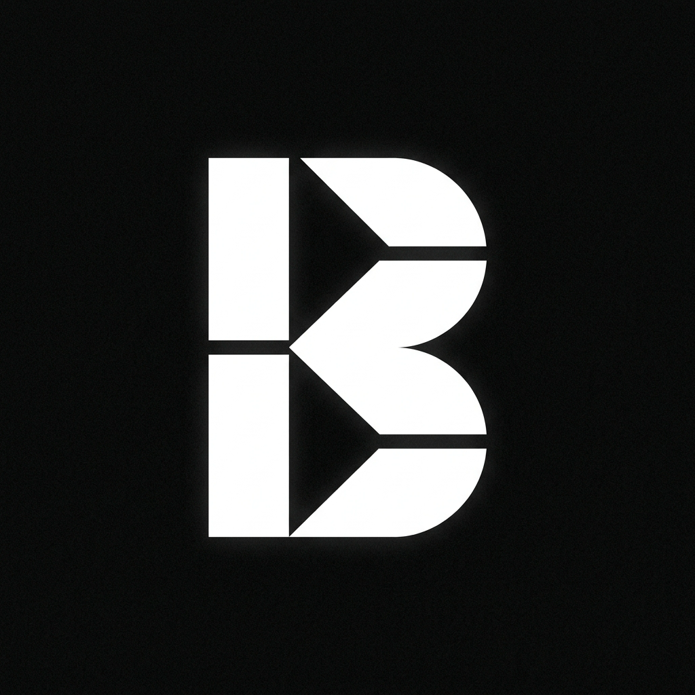

<div align="center">



# BLACK ENGINE

**La galería de wallpapers más brutalista y minimalista del universo.**  
Diseñada para creadores, fotógrafos y diseñadores que exigen el absoluto control sobre su paleta visual.

---

[](../../releases/latest/download/BlackEngine-Windows-x64.zip)
[](../../releases/latest/download/BlackEngine-macOS-Apple-Silicon.zip)
[](../../releases/latest/download/BlackEngine-macOS-Intel.zip)
[](../../releases/latest/download/BlackEngine-Linux-x64.zip)


</div>

---

## ⬇️ Descargas Directas

Elige tu sistema operativo. Cada descarga es **100% independiente** — no requiere instalar .NET, SDKs ni dependencias externas.

| Sistema Operativo | Arquitectura | Descarga |
|:---|:---|:---|
| 🪟 **Windows** | x64 (64-bit) | [BlackEngine-Windows-x64.zip](../../releases/latest/download/BlackEngine-Windows-x64.zip) |
| 🍎 **macOS** | Apple Silicon (M1/M2/M3) | [BlackEngine-macOS-Apple-Silicon.zip](../../releases/latest/download/BlackEngine-macOS-Apple-Silicon.zip) |
| 🍎 **macOS** | Intel (x86_64) | [BlackEngine-macOS-Intel.zip](../../releases/latest/download/BlackEngine-macOS-Intel.zip) |
| 🐧 **Linux** | x64 (64-bit) | [BlackEngine-Linux-x64.zip](../../releases/latest/download/BlackEngine-Linux-x64.zip) |

---

## 🚀 Cómo Ejecutar

### 🪟 Windows
1. Descarga `BlackEngine-Windows-x64.zip` y descomprímelo.
2. Haz doble clic en `BlackEngine.exe`.  
   > ⚠️ Si Windows Defender muestra una advertencia ("App desconocida"), haz clic en **Más información → Ejecutar de todas formas**. Esto es normal para apps sin firma de Microsoft Store.

### 🍎 macOS (Apple Silicon / Intel)
1. Descarga y descomprime el ZIP correspondiente a tu Mac.
2. Abre la **Terminal** y ejecuta:
   ```bash
   chmod +x BlackEngine && ./BlackEngine
   ```
   > ⚠️ Si macOS bloquea la app la primera vez ("desarrollador no identificado"), ve a  
   > **Ajustes del Sistema → Privacidad y Seguridad → Abrir de todas formas**.

### 🐧 Linux
1. Descarga y descomprime `BlackEngine-Linux-x64.zip`.
2. Abre la terminal en la carpeta y ejecuta:
   ```bash
   chmod +x BlackEngine && ./BlackEngine
   ```

---

## ✦ Características

### 🖼️ Galería Brutalista de Alta Fidelidad
- **Feed en Tiempo Real**: Sincronización directa con la base de datos distribuida en GitHub — cada wallpaper se carga desde la nube sin instalaciones adicionales.
- **Filtros Pro Multidimensionales**: Filtra por categoría, dispositivo (PC / Móvil) y favoritos con chips de acción de alta precisión.
- **Buscador Spotlight** (`⌘K`): Búsqueda de alta velocidad con comandos inteligentes integrados.

### 📺 Modo Presentación "Ambient Focus"
- **Slideshow Cinematográfico** a pantalla completa con dissolve ultra-suave.
- **Temporizador Pomodoro Suizo** integrado con ciclos de `25:00` (Concentración) y `05:00` (Descanso).
- Al completar cada ciclo, el wallpaper avanza automáticamente con una notificación Toast.
- Controles brutalistas: Play/Pause (`▶/⏸`), Reinicio (`↺`), Toggle del HUD (`⏱`), Avance manual (`◀/▶▶`).

### 📐 Cuadrícula de Composición Técnica
- Superposición de **regla de tercios fotográfica** con líneas de puntos y retículo central de precisión.
- Ideal para analizar el balance visual, flujo cromático y posición de widgets antes de aplicar un fondo.

### 💻 Simulador de Dispositivo Dual
- **📱 iOS Lockscreen**: Vista previa del wallpaper como pantalla de bloqueo con reloj en vivo.
- **💻 macOS Desktop**: Simulación de escritorio con barra translúcida, Dock y widgets de calendario.

### ⓘ Ficha Técnica "Blueprint Drawer"
- Resolución recomendada por dispositivo (`3840×2160 UHD 4K` / `1440×3200 QHD+`).
- **Dominante Emocional**: Análisis heurístico de la paleta (Obsidiana / Pastel / Cyberpunk / Solar).
- **Energía Cromática**: Indicador de contraste y luminancia de la imagen.

### 🎨 Generador de Color 3D
- Rueda de color HSL tridimensional con navegación completa.
- Entrada de código hexadecimal manual con sincronización instantánea a la rueda.
- La rueda **gira automáticamente** para centrar cualquier color seleccionado o introducido.
- Exportación de color como fondo sólido en resolución PC (`3840×2160`) o Móvil (`1440×3200`).
- Extractor de paleta armónica al previsualizar cualquier wallpaper.

### 🌾 Texturas Táctiles
- Tres niveles de ruido orgánico superpuesto: Ninguno, Fino y Táctil.

---

## 🛠️ Compilar desde el Código Fuente

Requiere [.NET 10 SDK](https://dotnet.microsoft.com/download/dotnet/10.0).

```bash
# Clonar el repositorio
git clone https://github.com/TU_USUARIO/BlackEngine.git
cd BlackEngine

# Ejecutar en modo desarrollo
dotnet run --project BlackEngine

# Generar empaquetado independiente para tu plataforma
dotnet publish BlackEngine -c Release -r osx-arm64 --self-contained true -p:PublishSingleFile=true
# Opciones de runtime: win-x64 | osx-arm64 | osx-x64 | linux-x64
```

---

## 📁 Estructura del Proyecto

```
BlackEngine/
├── Models/
│   └── Wallpaper.cs              # Modelo de datos con DeviceType y metadatos
├── Services/
│   └── GitHubDatabaseService.cs  # Sincronización distribuida en GitHub
├── ViewModels/
│   └── MainWindowViewModel.cs    # Lógica completa con Pomodoro, Paleta, Filtros
├── Controls/
│   └── ColorWheelControl.axaml   # Rueda 3D interactiva con auto-rotación
└── MainWindow.axaml              # UI brutalista principal con todos los overlays
```

---

## 📄 Licencia

Distribuido bajo la licencia **MIT**. Consulta el archivo `LICENSE` para más información.

---

<div align="center">
  Hecho con obsesión brutalista por <strong>Oscar Alfredo Pérez Lara</strong>
  <br/>
  <sub>BlackEngine — Donde el negro absoluto encuentra su propósito.</sub>
</div>
